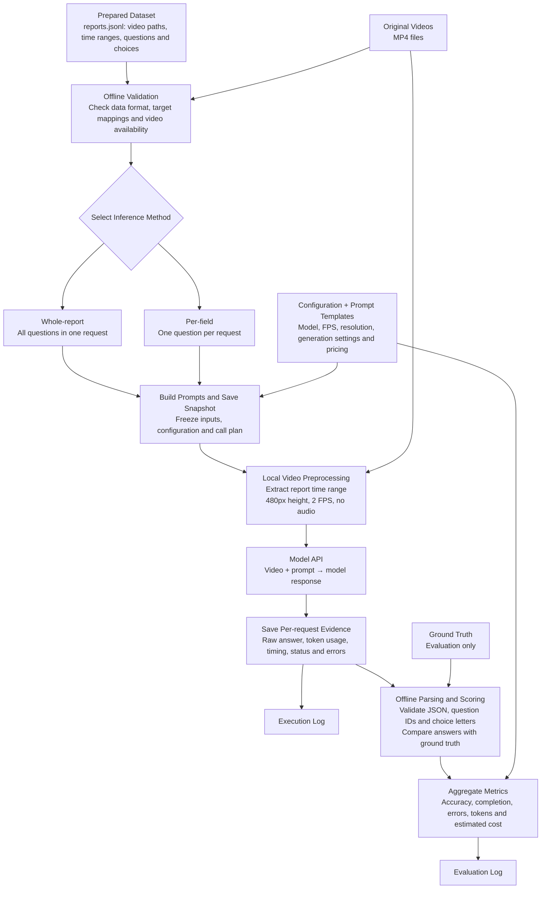

# Five-video end-to-end smoke test: workflow and results

Test date: October 8, 2026. Purpose: verify video ingestion, API execution, response persistence, parsing, scoring, token accounting and estimated cost logging.
All 45 video requests succeeded without retries. All 80 returned answers were valid and complete.

## End-to-end workflow

Reference answers are used only for offline evaluation. Each per-field request independently sends the same video segment; conversation history is not carried between requests. The diagram describes the pipeline; the results below were collected using Gemini through Vertex Express.

## Setup

- Dataset: HD-EPIC-derived prepared questions, `hd_epic_smoke5_loc8_v1`.
- Five distinct videos/participants; eight localization questions per video; 40 unique questions.
- Whole-report: one eight-question request per video (5 requests).
- Per-field: eight independent one-question requests per video (40 requests).
- Provider: Vertex Express; model: `gemini-3.5-flash-lite`.
- Same video interval, byte-identical prepared video, question text/choices, system prompt and generation policy for both methods.
- Local input policy: 480-pixel height, 2 FPS, H.264, CRF 30, no audio.
- Temperature 0; maximum output 2,048 tokens; JSON response mode; concurrency 1; one attempt per call; API timeout 300 seconds.
- System prompt originated in the repository and was reused unchanged. User prompts are rendered from the same template with eight or one question.
- P09 results were reused; the remaining four videos were run afterward. Logging additions changed package fingerprints between early phases; inference settings were held fixed.
- Full credentials and authentication headers are excluded.

## End-to-end validation

- Data: 5 reports and 40 valid target mappings; all source video files found.
- Download integrity: all five original MP4s match official MD5 checksums.
- Prepared media: all five clips fully decode; all 45 sent video payloads match saved clips.
- API: 45 successful requests, no failures or retries; every response reports VIDEO input tokens.
- Answers: 80/80 valid, 0 missing, 0 invalid values, 0 JSON parsing failures, 0 unexpected keys.
- Scoring: paired by `(report_id, field_id)` against stored ground truth.
- Accounting: raw token totals, input-modality breakdowns and cache-discount costs independently reconciled.
- Acceptance conclusion: the tested end-to-end pipeline works for these inputs. Accuracy is not an acceptance criterion requiring all answers to be correct.

## Whole-report: aggregate statistics

- Requests: 5; correct: 15/40; accuracy: 37.5%; incorrect: 25.
- Valid-answer rate: 100%; report completeness: 100%; fully correct reports: 0/5.
- Input tokens: 140,793; cached input subset: 0; output: 532; total: 141,325.
- No positive reasoning-token usage was reported. Missing reasoning/cache breakdowns are not independent measurements of zero.
- Estimated cost: US$0.04356790; average per video: US$0.00871358; per evaluated question: US$0.00108920; per correct answer: US$0.00290453.
- Execution wall time, summed across phases: 92.3794 seconds.
- API round-trip sum: 50.2602 s; mean: 10.0520 s; median: 9.5827 s; min/max: 8.7247/12.8300 s; descriptive p95: 12.2244 s.
- Media preprocessing/cache-lookup sum: 41.7947 seconds.

## Per-field: aggregate statistics

- Requests: 40; correct: 12/40; accuracy: 30.0%; incorrect: 28.
- Valid-answer rate: 100%; report completeness: 100%; fully correct reports: 0/5.
- Input tokens: 1,055,119; cached input subset: 62,650; output: 606; total: 1,055,725.
- No positive reasoning-token usage was reported. Missing reasoning/cache breakdowns are not independent measurements of zero.
- Estimated cost: US$0.30113520; average per video: US$0.06022704; per evaluated question: US$0.00752838; per correct answer: US$0.02509460.
- Execution wall time, summed across phases: 231.2051 seconds.
- API round-trip sum: 187.1602 s; mean: 4.6790 s; median: 3.9533 s; min/max: 2.4724/12.1226 s; descriptive p95: 8.7633 s.
- Media preprocessing/cache-lookup sum: 42.2845 seconds.

## Per-video results

### P09/P09-20240622-162302.mp4 — hdepic-dense-016
- Original-video interval: 30.989–401.649 s; duration 370.660 s; 8 questions.
- Whole-report: 5/8 correct (62.5%); 1 requests; input 25,961, cached subset 0, output 107, total 26,068 tokens; estimated US$0.00805580; API round trips 9.3210 s; provider-call latency sum 17.7043 s.
- Per-field: 5/8 correct (62.5%); 8 requests; input 193,415, cached subset 0, output 118, total 193,533 tokens; estimated US$0.05831950; API round trips 37.9251 s; provider-call latency sum 45.8249 s.

### P02/P02-20240210-113925.mp4 — hdepic-dense-022
- Original-video interval: 119.040–519.870 s; duration 400.830 s; 8 questions.
- Whole-report: 4/8 correct (50.0%); 1 requests; input 27,872, cached subset 0, output 106, total 27,978 tokens; estimated US$0.00862660; API round trips 9.5827 s; provider-call latency sum 16.3401 s.
- Per-field: 3/8 correct (37.5%); 8 requests; input 208,766, cached subset 25,786, output 122, total 208,888 tokens; estimated US$0.05597258; API round trips 34.7767 s; provider-call latency sum 42.1087 s.

### P04/P04-20240414-162750.mp4 — hdepic-dense-052
- Original-video interval: 101.079–680.840 s; duration 579.761 s; 8 questions.
- Whole-report: 2/8 correct (25.0%); 1 requests; input 39,338, cached subset 0, output 107, total 39,445 tokens; estimated US$0.01206890; API round trips 12.8300 s; provider-call latency sum 25.6086 s.
- Per-field: 1/8 correct (12.5%); 8 requests; input 300,424, cached subset 36,864, output 123, total 300,547 tokens; estimated US$0.08048142; API round trips 51.5328 s; provider-call latency sum 65.0270 s.

### P01/P01-20240203-132119.mp4 — hdepic-dense-009
- Original-video interval: 793.490–1119.710 s; duration 326.220 s; 8 questions.
- Whole-report: 3/8 correct (37.5%); 1 requests; input 23,072, cached subset 0, output 106, total 23,178 tokens; estimated US$0.00718660; API round trips 9.8018 s; provider-call latency sum 16.9431 s.
- Per-field: 1/8 correct (12.5%); 8 requests; input 170,366, cached subset 0, output 121, total 170,487 tokens; estimated US$0.05141230; API round trips 30.3787 s; provider-call latency sum 37.6238 s.

### P03/P03-20240218-094452.mp4 — hdepic-dense-014
- Original-video interval: 405.319–754.669 s; duration 349.350 s; 8 questions.
- Whole-report: 1/8 correct (12.5%); 1 requests; input 24,550, cached subset 0, output 106, total 24,656 tokens; estimated US$0.00763000; API round trips 8.7247 s; provider-call latency sum 15.5834 s.
- Per-field: 2/8 correct (25.0%); 8 requests; input 182,148, cached subset 0, output 122, total 182,270 tokens; estimated US$0.05494940; API round trips 32.5469 s; provider-call latency sum 40.3555 s.

## Paired question outcomes

- Both methods correct: 10.
- Whole-report only correct: 5.
- Per-field only correct: 2.
- Both incorrect: 23.
- Whole-report accuracy was 7.5 percentage points higher in this sample.
- Per-field cost was 6.91 times whole-report cost.
- These are descriptive observations, not evidence of a general causal advantage or a report-size trend.

## Pricing and total cost

- Public global standard list price per million tokens: input US$0.30; cached input US$0.03; output including reported reasoning US$2.50.
- Source: https://cloud.google.com/gemini-enterprise-agent-platform/generative-ai/pricing ; verified October 8, 2026.
- Cached tokens are already included in input totals; the discount is applied without adding them twice.
- Video-test total: US$0.34470310.
- Earlier short text connectivity probe: US$0.000004.
- Combined estimated total including that probe: US$0.34470710.
- Costs are list-price estimates; invoices, account credits and discounts were not checked.

## Interpretation and limits

- One observation per method on only five videos, one question category and one order; no repeated-size experiment.
- Report windows were selected by the preparation script from original question input intervals, then retained when eight questions were selected. They are not whole original videos.
- No new questions were authored. Scoring trusts the existing ground truth; not all 40 questions were independently manually verified.
- 2 FPS, downscaling and audio removal can affect answer accuracy, especially for subsecond actions.
- VIDEO token accounting confirms accepted video input, not that every answer was grounded solely in the video.
- API round-trip time includes upload, backend processing and download. Backend-only model inference time was not supplied.
- Provider-call latency includes media processing/cache lookup and API work; execution wall time additionally includes local bookkeeping.
- p95 uses linear interpolation and is descriptive; five whole-report calls are insufficient for stable tail-latency estimates.
- Incorrect single-choice answers are not labeled as hallucinations. Hallucination rate was not measured.

## Files available for selection

- `smoke_test.log`: consolidated input/output, checkpoints, scoring and usage evidence.
- `all_stats.json`: aggregate and per-video statistics with timing distributions.
- `per_call_stats.jsonl`: all 45 calls, exact frozen requests, normalized raw answers, usage, per-call cost/timing and field scores.
- `paired_answers.jsonl`: all 40 paired model answers and ground-truth letters.
- `cost_validation.json`: independent token and cached-cost reconciliation.
- Original phase directories retain actual base64 API bodies, complete API JSON responses, prepared MP4s, configs and snapshots.

## Evidence links

- [Complete consolidated smoke test log](https://drive.google.com/file/d/1JRRXlSJyu70cYARgR3fLCwe6H4jZHhP8/view)
- `all_stats.json` in the downloadable results package: all aggregate, per-video and timing statistics.
- `per_call_stats.jsonl` in the downloadable results package: all 45 per-request records: inputs, answers, usage, cost and timing.
- `paired_answers.jsonl` in the downloadable results package: all 40 paired answers and reference answers.
- `cost_validation.json` in the downloadable results package: independent token and cost validation.
- [Downloadable results package](https://drive.google.com/file/d/15-adSWXfZVVY1ph-Nx889uycEkd62VXc/view)

API credentials are not included in this document or the linked result files.

[Google Docs version](https://docs.google.com/document/d/17s3jNz0POdtbqAxCsP0m52t7RLO1spPvcdAKyYDotVg). Evidence links require the appropriate Drive access.
